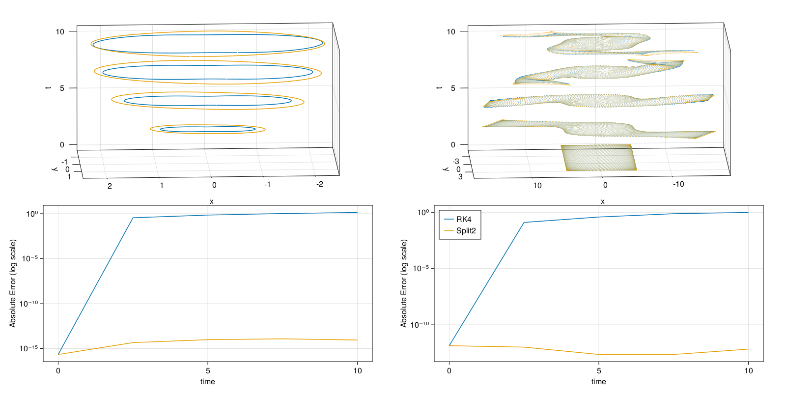

# Charged Particle

In the second part of the tutorial we will treat a non-canonical system and show how to [`compute!`](@ref) Poincaré integral invariants for it.
The system consists of a 2D charged particle subject to electromagnetic fields.
The equations of motion are

```math
\dot{x} = v,\; \dot{v} = E(x) + v × B(x)
```

where $x$ is the position vector, $v$ is the velocity, $E$ and $B$ are the electric and magnetic field and the mass and charge of the particle is set to one. For our example we will use a constant magnetic field of strength $10$ pointing in the z-direction and an electric field given by $E(x, y) = (-x, -y^3)$.

## Integration

Again, we'll quickly implement our own integrators here, namely the [Runge-Kutta method (RK4)](https://en.wikipedia.org/wiki/Runge–Kutta_methods#The_Runge–Kutta_method) and a [second order symplectic splitting method for charged particles in electromagnetic fields](https://doi.org/10.1016/j.physleta.2016.12.031).

```julia
using PoincareInvariants
using StaticArrays

E(x, y) = (-x, -y^3)

A(x, y) = 5 .* (-y, x)
B(x, y) = 10.0
Bx(x, y, Δx) = 10 * Δx  # integral in x direction from x to x + Δx
By(x, y, Δy) = 10 * Δy  # integral in y direction from y to y + Δy

struct Split2 end

function ϕx((x, y, vx, vy), dt)
    Δx = vx * dt
    return (x + Δx, y, vx, vy - Bx(x, y, Δx))
end

function ϕy((x, y, vx, vy), dt)
    Δy = vy * dt
    return (x, y + Δy, vx + By(x, y, Δy), vy)
end

function ϕE((x, y, vx, vy), dt)
    (Δvx, Δvy) = dt .* E(x, y)
    return (x, y, vx + Δvx, vy + Δvy)
end

function timestep(z, dt, ::Split2)
    hdt = 0.5 * dt
    z = ϕx(z, hdt)
    z = ϕy(z, hdt)
    z = ϕE(z, dt)
    z = ϕy(z, hdt)
    z = ϕx(z, hdt)
    return z
end

struct RK4 end

function zdot((x, y, vx, vy))
    ex, ey = E(x, y); b = B(x, y)
    (vx, vy, ex + b * vy, ey - b * vx)
end

function timestep(z, dt, ::RK4)
    hdt = 0.5 .* dt
    k1 = zdot(z)
    k2 = zdot(z .+ hdt .* k1)
    k3 = zdot(z .+ hdt .* k2)
    k4 = zdot(z .+  dt .* k3)
    return z .+ dt .* (k1 .+ 2 .* k2 .+ 2 .* k3 .+ k4) .* (1/6)
end

"""
    integrate(z0, dt, nsteps, nt, method)

start at `z0` and integrate the equations of motion using `method`.
Returns the timeseries as a vector of tuples. `nt` points are saved,
`nsteps` steps are taken from saved point to saved point and `dt` is the
size of each time step.
"""
function integrate(z0, dt, nsteps, nt, method)
    out = Vector{NTuple{4, Float64}}(undef, nt)
    z = out[1] = z0
    for i in 2:nt
        for _ in 1:nsteps
            z = timestep(z, dt, method)
        end
        out[i] = z
    end
    return out
end

integrate(mat::AbstractMatrix, dt, nsteps, nt, method) = map(eachrow(mat)) do r
    integrate((r[1], r[2], r[3], r[4]), dt, nsteps, nt, method)
end
```

## Computing the Invariants

Having gotten integration out of the way, we can move onto the invariants. For this system, the first invariant is given by

```math
I_{1} = \int_{\gamma} v(x) + A(x) \, dx
```

where $A(x)$ is the magnetic vector potential as a function of the position vector $x$. The second invariant is given by

```math
I_{2} = \int_{S} \omega_{ij} (q) \, dz^{i} \, dz^{j}
```

with the two-form $\omega$ given by

```math
\begin{pmatrix}
 0 & B & -1 &  0 \\
-B & 0 &  0 & -1 \\
 1 & 0 &  0 &  0 \\
 0 & 1 &  0 &  0
\end{pmatrix}
```

In code, we can define these forms as follows.

```julia
function oneform((x, y, vx, vy), ::Real, ::Any)
    p = (vx, vy) .+ A(x, y)
    @SVector [p[1], p[2], 0, 0]
end

function twoform(z, ::Real, ::Any)
    b = B(z[1], z[2])
    @SMatrix [ 0  b -1  0;
              -b  0  0 -1;
               1  0  0  0;
               0  1  0  0]
end
```

Forms always have the signature `form(z, t, p)`, where `z` is the phasespace position, `t` is a time and `p` is an arbitrary parameter.
To use these forms to compute our invariants, we must create the setup objects `FirstPI` and `SecondPI` and initialise the curve and surface we want in phasespace.

```julia
pi1 = FirstPI{Float64, 4}(oneform, 1_000)
pi2 = SecondPI{Float64, 4}(twoform, 10_000)

I1 = 0
pnts1 = getpoints(pi1) do θ
    10 .* (0, 0, sinpi(2θ), cospi(2θ))
end

I2 = 1_000
pnts2 = getpoints(pi2) do x, y
    10 .* (y - 0.5, x - 0.5, 0, 0)
end
```

The curve is just a point in space, so the first integral invariant evaluates to zero.
The second invariant is equal to $1000$ since, it is equal to the magnetic field of strength $10$ integrated over a $10$ by $10$ square.
We can confirm this by computing the inital invariants.

```julia
@assert isapprox(compute!(pi1, pnts1, 52.3, "optional parameter"), I1; atol=10^(-15))
@assert isapprox(compute!(pi2, pnts2), I2; atol=10^(-11))
```

By default `p` is `nothing` and `t` is zero, but as shown in the first line we can also explicitly supply a time and parameter if the forms we defined earlier had required them. [`compute!`](@ref) used on a time series accepts an iterable of times and an arbitrary parameter.

```julia
times = range(0.0; step=0.05 * 50, length=5)

series1 = integrate(pnts1, 0.05, 50, 5, Split2())
@assert all(compute!(pi1, series1, times, ("optional parameters", 3.7, 42))) do I
    abs(I - I1) < 10^(-13)
end

series2 = integrate(pnts2, 0.05, 50, 5, Split2())
@assert all(compute!(pi2, series2)) do I
    abs(I - I2) < 10^(-11)
end
```

Again, we can plot the results. The top two plots show the increasingly distorted curve and surface over time (projected onto x and y position components), while the bottom two plots show the error in the invariant over time for the two integration algorithms.



We see that RK4 does not preserve the non-canonical invariant while the splitting method does.
