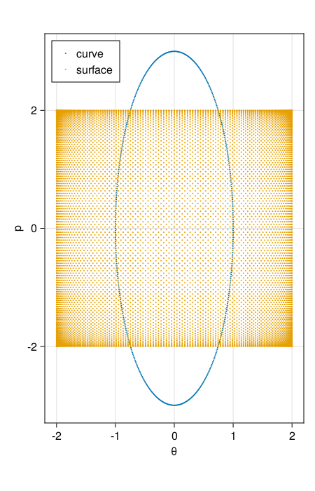
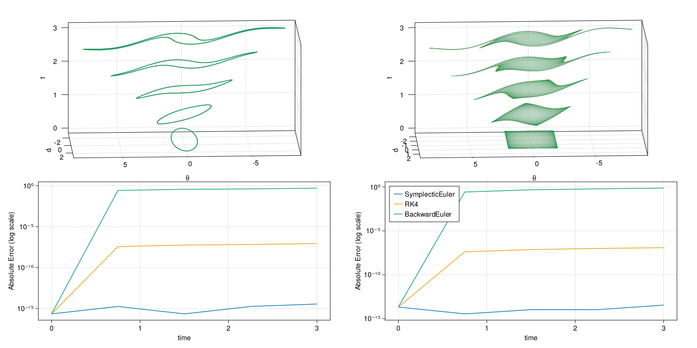

# Pendulum

In this tutorial we integrate the equations of motion for a pendulum and compute the first and second Poincaré integral invariants.
First, we integrate the equations of motion then we can compute the invariants to check whether they are in fact conserved.
The full script to generate the plots and do the computations shown here can be found at [examples/pendulum.jl](examples/pendulum.jl).

Let us begin. We will need to import [PoincareInvariants.jl](https://github.com/JuliaGNI/PoincareInvariants.jl).

```julia
using PoincareInvariants
```

## Integration

We'll quickly write our own integration code here for simplicity.
This library can be used with [DifferentialEquations.jl](https://github.com/SciML/DifferentialEquations.jl).
For the purposes of this tutorial we pick a unit system, such that gravity, mass and length are equal to one.
The equations of motion for the angle $\theta$ and angular momentum $p$ for a simple pendulum are therefore given by

```math
\dot{\theta} = p,\; \dot{p} = -\sin{\theta}
```

To integrate these equations of motion we will compare the [backward Euler method](https://en.wikipedia.org/wiki/Backward_Euler_method), the [symplectic Euler method](https://en.wikipedia.org/wiki/Semi-implicit_Euler_method) and *the* [Runge-Kutta method (RK4)](https://en.wikipedia.org/wiki/Runge–Kutta_methods#The_Runge–Kutta_method).
The following shows the implementations for stepping forward by one time step for each method.

```julia
pendulum((θ, p)) = (p, -sin(θ))

struct BackwardEuler end
function timestep((θ, p), dt, ::BackwardEuler)
    sinθ, cosθ = sincos(θ)
    p = (p - dt * sinθ) / (1 + dt^2 * cosθ)
    return θ + dt * p, p
end

struct SymplecticEuler end
function timestep((θ, p), dt, ::SymplecticEuler)
    θ = θ + dt * p  # update position
    p = p - dt * sin(θ)  # update momentum
    return θ, p
end

struct RK4 end
function timestep((θ, p), dt, ::RK4)
    k1 = pendulum((θ, p))
    k2 = pendulum((θ, p) .+ 0.5 .* dt .* k1)
    k3 = pendulum((θ, p) .+ 0.5 .* dt .* k2)
    k4 = pendulum((θ, p) .+ dt .* k3)
    return (θ, p) .+ (dt/6) .* (k1 .+ 2 .* k2 .+ 2 .* k3 .+ k4)
end
```

We'll also need some code to step many times and save the result.

```julia
"""
    integrate((θ₀, p₀), dt, nsteps, nt, method)

start at `(θ₀, p₀)` and integrate the equations of motion using `method`.
Returns the timeseries as a vector of tuples. `nt` points are saved,
`nsteps` steps are taken from saved point to saved point and `dt` is the
size of each time step.
"""
function integrate((θ₀, p₀), dt, nsteps, nt, method)
    out = Vector{Tuple{Float64, Float64}}(undef, nt)
    (θ, p) = out[1] = (θ₀, p₀)
    for i in 2:nt
        for _ in 1:nsteps
            (θ, p) = timestep((θ, p), dt, method)
        end
        out[i] = (θ, p)
    end
    return out
end
```

## Computing the Invariants

The first invariant is the integral

```math
I_{1} = \int_{\gamma} p(\theta) \, d\theta
```

which remains invariant as each point $(\theta(t), p(t))$ on the curve $\gamma$ moves in phasespace according to the above equations of motion.
The second invariant is the integral

```math
I_{2} = \int_{S} d\theta \, dp
```

which remains invariant as each point $(\theta(t), p(t))$ on the surface $S$ moves in phasespace according to the above equations of motion.

However, our numerical integration methods only approximate the true dynamics. So we might ask whether the two invariants are preserved,
even when integrated only approximately. To answer this question we compute the two integral invariants numerically.
The general approach to computing the invariants goes as follows.

1. Approximate the intial curve or surface in phasespace with a finite number of points.
2. Compute the initial curve or surface integral using the approximation given by the set of points.
3. Move the set of points in phasespace by integrating the equations of motion for each.
4. Compute the integral invariant again using the moved set of points to approximate the curve or surface.

In code, we start by initialising the setup objects `CanonicalFirstPI` and `CanonicalSecondPI` to preallocate everything we'll need for further computation.

```julia
pi1 = CanonicalFirstPI{Float64, 2}(500)
pi2 = CanonicalSecondPI{Float64, 2}(10_000)
```

`Float64` refers to the numeric type to use for calculations. For example, you could switch to [DoubleFloats.jl](https://github.com/JuliaMath/DoubleFloats.jl) for improved accuracy. The `2` refers to the dimension of phasespace. In our case, that's two, since the pendulum has two degrees of freedom, namely the angle and angular momentum. Finally, the numbers `1_000` and `10_000` refer to how many points to use to approximate the curve and surface in phasespace. The exact number of points actually used depends on the implementation used and may be inspected with [`getpointnum`](@ref)

```julia
@assert 500 ≤ getpointnum(pi1) ≤ 750
@assert 10_000 ≤ getpointnum(pi2) ≤ 15_000
```

Next, we'll need to initialise the curve and surface. For the first invariant, we use a unit circle stretched by a factor of three as our curve. The corresponding invariant is $3\pi$. For the second invariant, we use a four by four square centered at the origin. The corresponding invariant is $16$.  In code, this looks like

```
I1 = 3π
pnts1 = getpoints(pi1) do ϕ
    sinpi(2ϕ), 3 * cospi(2ϕ)
end

I2 = 16
pnts2 = getpoints(pi2) do x, y
    4 .* (x, y) .- 2
end
```

[`getpoints`](@ref) takes a parameterisation as its first argument and the setup object as its second argument. It returns a matrix, where each row is a point. The parameterisation must accept a value in the domain and maps it to a point in phase space, representing a point on the curve or surface to be integrated over. For the first invariant the domain is just $[0,1]$ and the parameterisation must be periodic. For the second invariant the domain is $[0,1]^{2}$, so the corresponding parameterisation must accept two inputs. The exact points in the domain at which the parameterisations are evaluated changes depending on the underlying implementation. The points used by the current implementation may be inspected using [`getpoints`](@ref) without a function argument.

```julia
getpoints(pi1)
getpoints(pi2)
```

Below is a plot of the initial points in phasespace.



Having initialised our initial curve and surface, we may compute the invariant as follows.

```
@assert isapprox(compute!(pi1, pnts1), I1; atol=10eps())
@assert isapprox(compute!(pi2, pnts2), I2; atol=10eps())
```

Now we'll want to integrate the equations of motion. To do this, let's introduce a quick helper function to integrate all points or rows.

```julia
integrate(mat::AbstractMatrix, dt, nsteps, nt, method) = map(eachrow(mat)) do pnt
    integrate((pnt[1], pnt[2]), dt, nsteps, nt, method)
end
```

As it turns out, `compute!` will work out of the box with a vector of time series like this. So we can just do

```julia
series1 = integrate(pnts1, 0.05, 15, 5, SymplecticEuler())
@assert all(compute!(pi1, series1)) do I
    abs(I - I1) < 10^(-14)
end

series2 = integrate(pnts2, 0.05, 15, 5, SymplecticEuler())
@assert all(compute!(pi2, series2)) do I
    abs(I - I2) < 10^(-13)
end
```

When `compute!` is given time series like this it will calculate the invariant for each time and return a `Vector` of the invariant values. Below is a plot of the points in phasespace and invariants over time. The left column corresponds to the first invariant and the right corresponds to the second. The top two plots show the increasingly distorted curve and surface over time, while the bottom two plots show the error in the invariant over time for different integration algorithms.



Given the data shown above, we can confirm that `SymplecticEuler` is in fact symplectic and preserves the two invariants very well, while the other two methods are not symplectic and hence do not conserve the associated invariants. These data are all the more impressive when you consider the significant distortion of the initial curve and surface and that `SymplecticEuler` is a first order method whereas `RK4` is a fourth order method.
