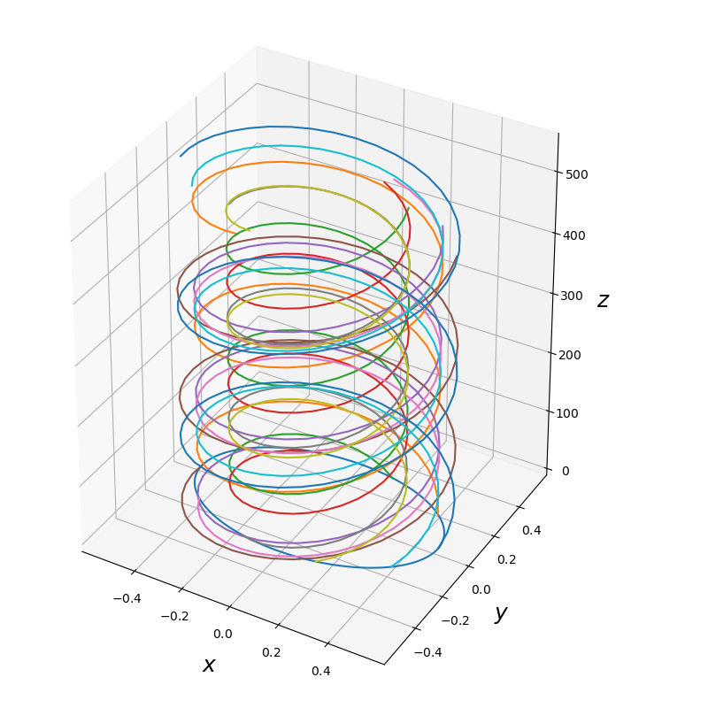
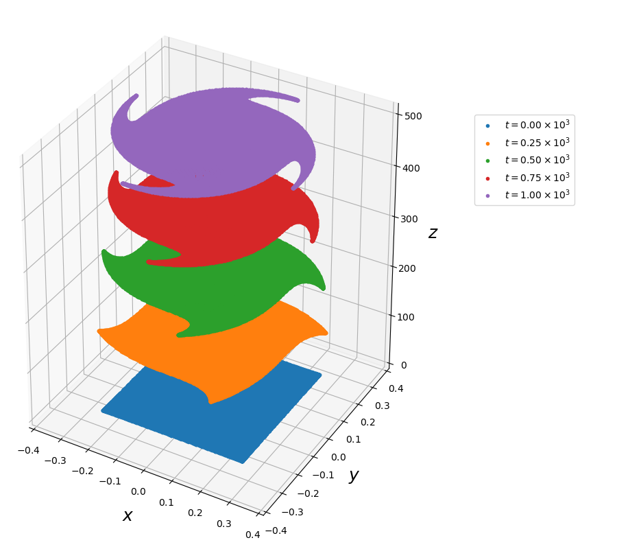

# PoincareInvariants.jl

Poincaré integral invariants provide useful diagnostics for analysing the long-time accuracy of numerical integrators for Hamiltonian dynamics and for distinguishing between symplectic and non-symplectic integrators.

This package provides means for computing the first and second Poincaré integral invariant $\vartheta$ and $\omega$, which are given by the Lagrangian one- and two-form, respectively.

## First Poincaré Invariant

The one-form $\vartheta$ is a relative integral invariant, which means that the integral
```math
I_{1} = \int_{\gamma} \vartheta_{i} (q) \, dq^{i}
```
stays constant in time when $\gamma$ is a closed loop in the configuration space $\mathcal{M}$ (a compact one-dimensional parametrized submanifold of $\mathcal{M}$ without boundary), that is advected along the solution of the dynamics.



The figure shows examples of single trajectories of some samples of such a loop, as well as the temporal evolution of the whole loop following the dynamics of the guiding centre system.

The loop $\gamma$ is parametrized by $\tau \in [0,1)$, so that
```math
I_{1} (t) = \int_{0}^{1} \vartheta_{i} (q_{(\tau)}(t)) \, \dfrac{d q_{(\tau)}^{i}}{d\tau} \, d\tau .
```
In order to compute this integral, we use $N$ equidistant points in $[0,1)$, so that the derivatives $d q_{(\tau)} / d\tau$ can be efficiently computed via discrete Fourier transforms. The integral is approximated with the trapezoidal quadrature rule, which has spectral convergence on periodic domains ([Trefethen & Weideman, 2014](https://doi.org/10.1137/130932132)).

## Second Poincaré Invariant

The two-form $\omega$ is an absolute integral invariant, which means that the integral
```math
I_{2} = \int_{S} \omega_{ij} (q) \, dq^{i} \, dq^{j}
```
stays constant in time when $S$ is any compact two-dimensional parametrized submanifold of $\mathcal{M}$, advected along the solution of the dynamics.



The figure shows how an initially rectangular area in phasespace is advected by the dynamics of the guiding centre system.

The area $S$ is parametrized by $(\sigma, \tau) \in [0,1]^{2}$, so that
```math
I_{2} (t) = \int_{0}^{1} \int_{0}^{1} \omega_{ij} (q_{(\sigma, \tau)} (t)) \, \dfrac{dq_{(\sigma, \tau)}^{i}}{d\sigma} \, \dfrac{dq_{(\sigma, \tau)}^{j}}{d\tau} \, d\sigma \, d\tau .
```
Here, we represent the surface in terms of Chebyshev polynomials and thus use Chebyshev points for the discretization of the domain $[0,1]^{2}$. The Chebyshev polynomials allow for an extremely accurate approximation of the surface, even if the latter becomes severely deformed. Moreover, they allow for the use of the [ApproxFun.jl](https://github.com/JuliaApproximation/ApproxFun.jl) package for the easy and accurate computation of the derivatives and the integral.
